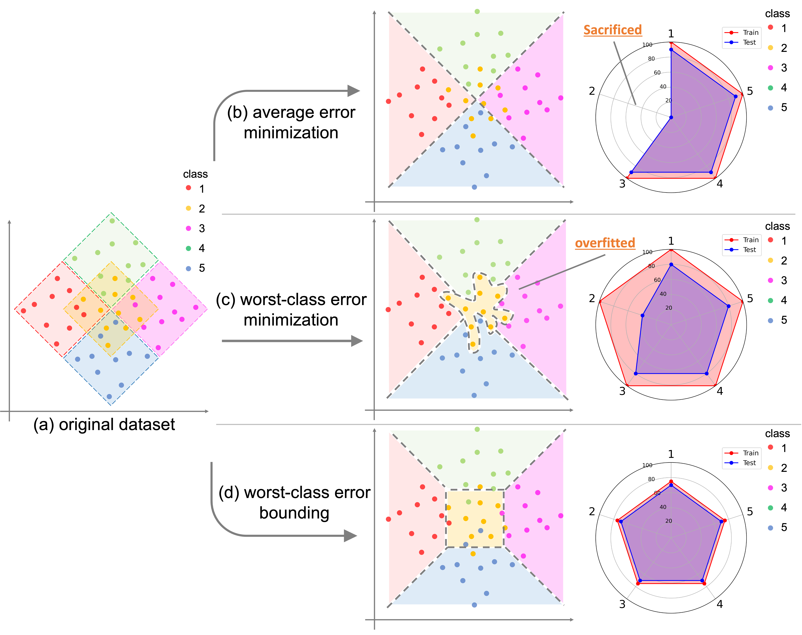

<!-- <<<<<<< HEAD -->

# Bounding the Worst-class Error: A Boosting Approach

This repository provides the offical release of the code package for my paper Boosing for Bounding the Worst-class Error　(url comming soon).
The code heavily relies on [LDAM-DRW](https://github.com/kaidic/LDAM-DRW).

[Paper](https://arxiv.org/abs/2310.14890) | [Bibtex](url) | [Slides](url)

## Overveiw of Our Method


> This paper first tackles the problem of the worst-class error rate instead of the standard error rate averaged over all classes. For example, a three-class classification task with class-wise error rates of 10%, 10%, and 40% has a worst-class error rate of 40\%, whereas the average is 20% under the class-balanced condition. To avoid overfitting in worst-class error minimization using a rich hypothesis set such as Deep Neural Networks (DNNs), we design a problem formulation for bounding the worst-class error instead of achieving zero worst-class error. Moreover, to correctly bound the worst-class error, we propose a boosting approach that ensembles DNNs.
We provide training and generalization worst-class error bounds, which also provide new insight into imbalanced classification tasks. Experimental results show that the algorithm reduces worst-class test error rates while avoiding overfitting to the training set.

## Requirements 
<!-- All codes are written by Python 3.7, and 'requirements.txt' contains required Python packages. -->
- python >= 3.8
- cuda & cudnn

### prerequisitions
- python 3.8.17
- seaborn  0.12.2
- scikit-learn  1.3.0
- pandas 2.0.3
- Pillow 10.0.0
- torch  2.0.1
- torchvision 0.15.2
- pytorch_transformers
- tqdm  4.65.0
- opencv-python 4.8.0.74
- medmnist 2.2.2
- numpy 1.22.3


To install fast-setup of this code:

```setup
# pytorch install 
pip install torch torchvision torchaudio --index-url https://download.pytorch.org/whl/cu121
pip install -r requirements.txt
```


<!-- 
## Dataset

Create 'data/' directory and download original data in the directory to make imbalanced versions. 
- Imbalanced [CIFAR](https://www.cs.toronto.edu/~kriz/cifar.html). The original data will be downloaded and converted by `imbalancec_cifar.py`.
- Imbalanced [Tiny ImageNet](http://cs231n.stanford.edu/tiny-imagenet-200.zip). Download the data first, and convert them by `imbalance_tinyimagenet.py`.
- The paper also reports results on iNaturalist 2018. We will update the code for iNaturalist 2018 later. -->

## Training & Test

We provide several examples:

### CIFAR10
- CE baseline

```bash
python cifar_train.py --dataset cifar10 -a resnet32 --loss_type CE --train_rule None --epochs 200 --b 512 --num_classes 10 --gpu 0 --early_stop True --stop_mode average
```
- IB + CB

```bash
python cifar_train.py --dataset cifar10 -a resnet32 --loss_type IB --train_rule CBReweight --epochs 200 --b 512 --start_ib_epoch 50 --num_classes 10 --gpu 0 --early_stop True --stop_mode average 
```
- Naive

```bash
python cifar_train.py --dataset cifar10 -a resnet32 --loss_type WorstLoss --train_rule None --epochs 200 --b 512 --num_classes 10 --gpu 0 --early_stop True --stop_mode worst
```

- Ours
```bash
python ./Ours/cifar_train.py --dataset cifar10 -a resnet32 --theta 0.9 --loss_type CE --b 512 --num_classes 10 --gpu 0 

```


### Medmnist (TisuueMNIST)
Fast of all, changes the code of ```models/__init__.py``` and run the listed example code.

```bash
# from .resnet_cifar import * 
from .resnet_med_resnet_s import *
```

- CE (w /fCW)

```bash
python medmnist_train.py --dataset medmnist --data_flag tissuemnist -a resnet18 --num_in_channels 1 --loss_type CE --train_rule fCW --epochs 100 --b 512 --num_classes 8 --gpu 0 --early_stop True --stop_mode average
```
- Focal

```bash
python medmnist_train.py --dataset medmnist --data_flag tissuemnist -a resnet18 --num_in_channels 1 --loss_type Focal --epochs 100 --b 512 --num_classes 8 --gpu 0 --early_stop True 
```

- Ours
```bash
python ./Ours/medmnist_train.py --dataset medmnist --data_flag tissuemnist -a resnet18 --theta 0.6 --num_in_channels 1 --b 512 --num_classes 8 --loss_type CE --gpu 0 
```

## Citation

If you find our paper and repo useful, please cite our paper

```
@InProceedings{hoge,
    author    = {hoge},
    title     = {Bounding the Worst-class Error: A Boosting Approach},
    booktitle = {hoge},
    month     = {hoge},
    year      = {hoge},
    pages     = {hoge}
}
```
<!-- =======
# Boosting for Bounding the Worst-class Error (AISTATS, 2023)
>>>>>>> 71d71e6ba1e292b2b021ccdc18890e7f9db02fb5 -->
