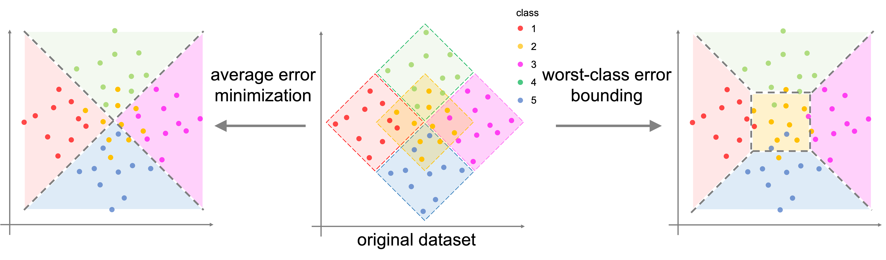

<!-- <<<<<<< HEAD -->

# Boosting for Bounding the Worst-class Error (AISTATS, 2023)

This repository provides the offical release of the code package for my paper Boosing for Bounding the Worst-class Error in AISTATS 2023 (url comming soon).
The code heavily relies on [LDAM-DRW](url).

[Paper](url) | [Bibtex](url) | [Slides](url)

## Overveiw of Our Method


> Overview of our Boosting method.

## Requirements 
All codes are written by Python 3.7, and 'requirements.txt' contains required Python packages.
To install requirements:

```setup
pip install -r requirements.txt
```
<!-- 
## Dataset

Create 'data/' directory and download original data in the directory to make imbalanced versions. 
- Imbalanced [CIFAR](https://www.cs.toronto.edu/~kriz/cifar.html). The original data will be downloaded and converted by `imbalancec_cifar.py`.
- Imbalanced [Tiny ImageNet](http://cs231n.stanford.edu/tiny-imagenet-200.zip). Download the data first, and convert them by `imbalance_tinyimagenet.py`.
- The paper also reports results on iNaturalist 2018. We will update the code for iNaturalist 2018 later. -->

## Training

We provide several training examples:

### CIFAR
- CE baseline (CIFAR-100, long-tailed imabalance ratio of 100)

```bash
python cifar_train.py --dataset cifar100 --loss_type CE --train_rule None --imb_type exp --imb_factor 0.01 --epochs 200 --num_classes 100 --gpu 0
```
- IB (CIFAR-100, long-tailed imabalance ratio of 100)

```bash
python cifar_train.py --dataset cifar100 --loss_type IB --train_rule IBReweight --imb_type exp --imb_factor 0.01 --epochs 200 --num_classes 100 --start_ib_epoch 100 --gpu 0

```
- IB + CB (CIFAR-100, long-tailed imabalance ratio of 100)

```bash
python cifar_train.py --dataset cifar100 --loss_type IB --train_rule CBReweight --imb_type exp --imb_factor 0.01 --epochs 200 --num_classes 100 --start_ib_epoch 100 --gpu 0

```
- IB + Focal (CIFAR-100, long-tailed imabalance ratio of 100)

```bash
python cifar_train.py --dataset cifar100 --loss_type IBFocal --train_rule IBReweight --imb_type exp --imb_factor 0.01 --epochs 200 --num_classes 100 --start_ib_epoch 100 --gpu 0

```

### Tiny ImageNet
- CE baseline (long-tailed imabalance ratio of 100)

```bash
python tinyimage_train.py --dataset tinyimagenet -a resnet18 --loss_type CE --train_rule None --imb_type exp --imb_factor 0.01 --epochs 100 --lr 0.1  --num_classes 200

```
- IB (long-tailed imabalance ratio of 100)

```bash
python tinyimage_train.py --dataset tinyimagenet -a resnet18 --loss_type IB --train_rule IBReweight --imb_type exp --imb_factor 0.01 --epochs 100 --lr 0.1  --num_classes 200 --start_ib_epoch 50

```

## Citation

If you find our paper and repo useful, please cite our paper

```
@InProceedings{hoge_2023_AISTATS,
    author    = {hoge},
    title     = {Boosting for Bounding the Worst-class Error},
    booktitle = {hoge},
    month     = {hoge},
    year      = {hoge},
    pages     = {hoge}
}
```
=======
# Boosting for Bounding the Worst-class Error (AISTATS, 2023)
>>>>>>> 71d71e6ba1e292b2b021ccdc18890e7f9db02fb5
