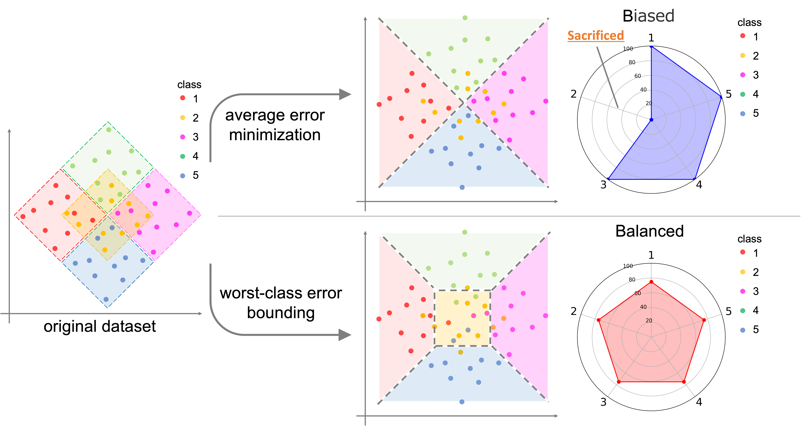

<!-- <<<<<<< HEAD -->

# Boosting for Bounding the Worst-class Error

This repository provides the offical release of the code package for my paper Boosing for Bounding the Worst-class Error　(url comming soon).
The code heavily relies on [LDAM-DRW](url).

[Paper](url) | [Bibtex](url) | [Slides](url)

## Overveiw of Our Method


> This paper tackles the problem of the worst-class error rate, instead of the standard error rate averaged over all classes. For example, a three-class classification task with class-wise error rates of 10\%, 10\%, and 40\% has a worst-class error rate of 40\%, whereas the average is 20\% under the class-balanced condition. The worst-class error is important in many applications. For example, in a medical image classification task, it would not be acceptable for the malignant tumor class to have a 40\% error rate, while the benign and healthy classes have 10\% error rates. We propose a boosting algorithm that guarantees an upper bound of the worst-class training error and derive its generalization bound. Experimental results show that the algorithm lowers worst-class test error rates while avoiding overfitting to the training set.

## Requirements 
All codes are written by Python 3.7, and 'requirements.txt' contains required Python packages.
To install requirements:

```setup
pip install -r requirements.txt
```
<!-- 
## Dataset

Create 'data/' directory and download original data in the directory to make imbalanced versions. 
- Imbalanced [CIFAR](https://www.cs.toronto.edu/~kriz/cifar.html). The original data will be downloaded and converted by `imbalancec_cifar.py`.
- Imbalanced [Tiny ImageNet](http://cs231n.stanford.edu/tiny-imagenet-200.zip). Download the data first, and convert them by `imbalance_tinyimagenet.py`.
- The paper also reports results on iNaturalist 2018. We will update the code for iNaturalist 2018 later. -->

## Training

We provide several training examples:

### EMNIST
- CE baseline

```bash
python emnist_train.py --dataset emnist -a resnet18 --num_in_channels 1 --loss_type CE --train_rule None --epochs 100 --b 512 --num_classes 62 --gpu 0 --early_stop True --stop_mode average 
```
- IB + CB

```bash
python emnist_train.py --dataset emnist -a resnet18 --num_in_channels 1 --loss_type IB --train_rule CBReweight --epochs 100 --b 512 --start_ib_epoch 50 --num_classes 62 --gpu 0 --early_stop True --stop_mode average 
```
- Naive

```bash
python emnist_train.py --dataset emnist -a resnet18 --num_in_channels 1 --loss_type WorstLoss --train_rule None --epochs 100 --b 512 --num_classes 62 --gpu 0 --early_stop True --stop_mode worst
```

- Ours
```bash
python /Ours/emnist_train.py --dataset emnist -a resnet18  --theta 0.3 --num_in_channels 1 --b 512 --num_classes 62 --loss_type CE --gpu 0
```


### Medmnist (TisuueMNIST)
- CE (w /fCW)

```bash
python medmnist_train.py --dataset medmnist --data_flag tissuemnist -a resnet18 --num_in_channels 1 --loss_type CE --train_rule fCW --epochs 100 --b 512 --num_classes 8 --gpu 0 --early_stop True --stop_mode average
```
- Focal

```bash
python medmnist_train.py --dataset medmnist --data_flag tissuemnist -a resnet18 --num_in_channels 1 --loss_type Focal --epochs 100 --b 512 --num_classes 8 --gpu 0 --early_stop True 
```

- Ours
```bash
python /Ours/medmnist_train.py --dataset medmnist --data_flag tissuemnist -a resnet18 --theta 0.5 --num_in_channels 1 --b 512 --num_classes 8 --loss_type CE --gpu 0 
```

## Citation

If you find our paper and repo useful, please cite our paper

```
@InProceedings{hoge,
    author    = {hoge},
    title     = {Boosting for Bounding the Worst-class Error},
    booktitle = {hoge},
    month     = {hoge},
    year      = {hoge},
    pages     = {hoge}
}
```
<!-- =======
# Boosting for Bounding the Worst-class Error (AISTATS, 2023)
>>>>>>> 71d71e6ba1e292b2b021ccdc18890e7f9db02fb5 -->
